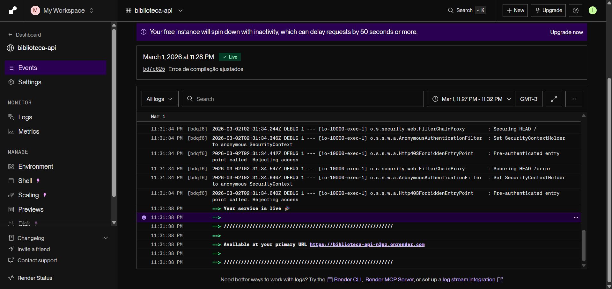
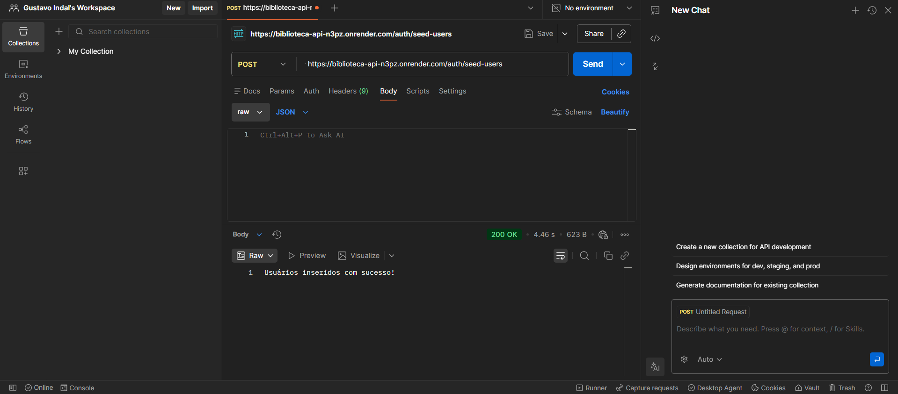
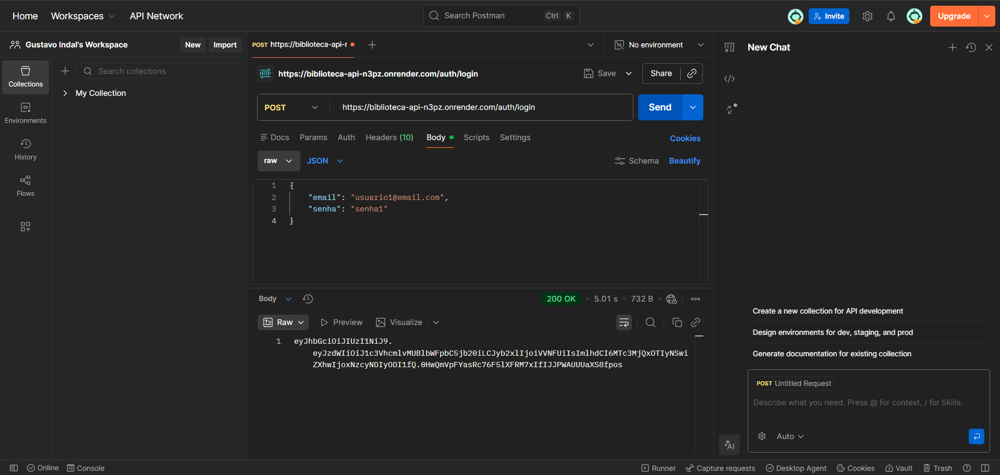
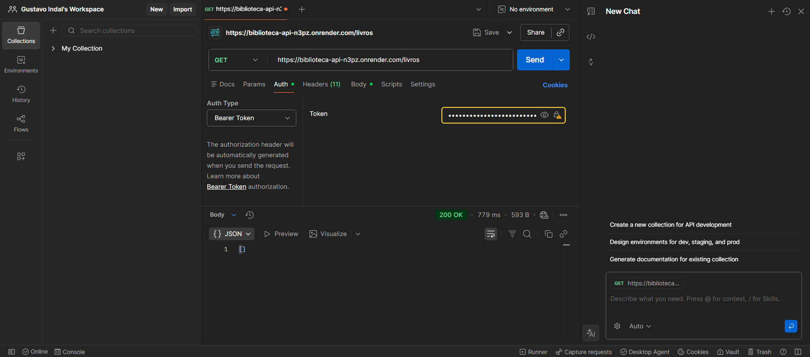
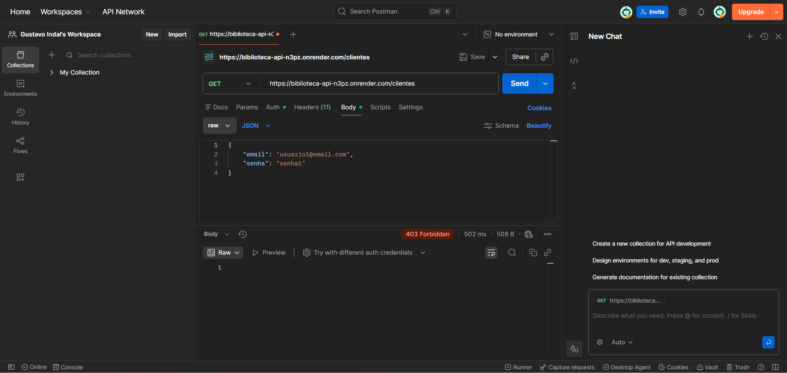
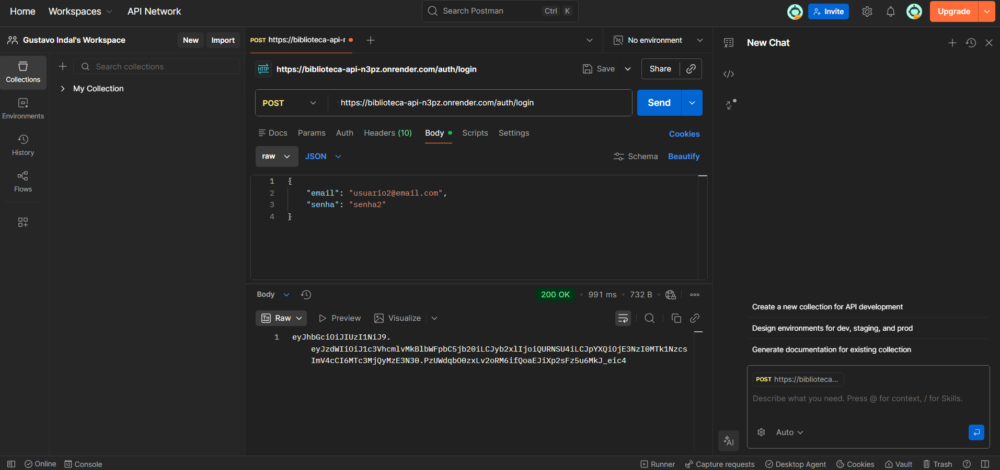
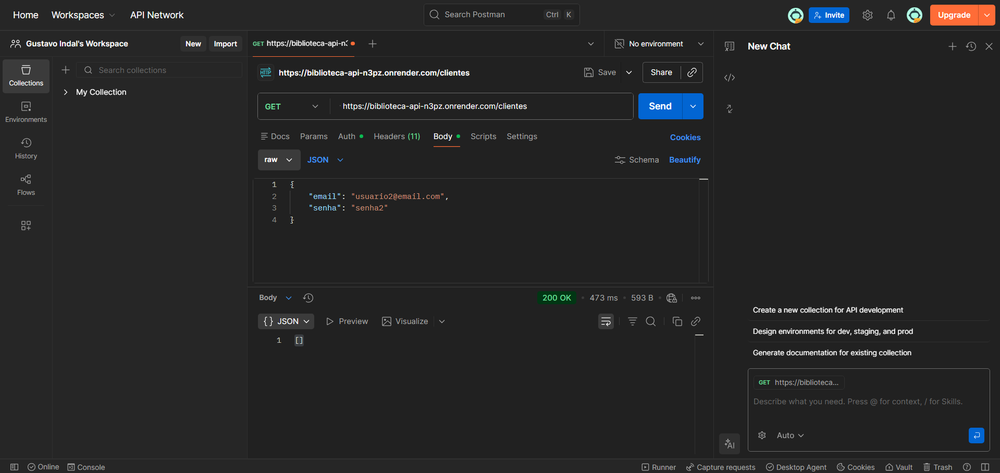
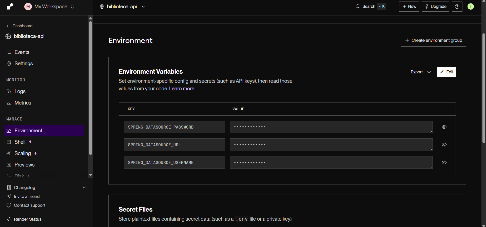

<h1 align="center">📚 Biblioteca API</h1>

API REST para gerenciamento de livraria com autenticação JWT,
controle de acesso por perfil e deploy em produção.

---

## 🌐 Deploy (Produção)

A aplicação está disponível online via Render:

🔗  https://biblioteca-api-n3pz.onrender.com

> ⚠️ Observação: o projeto utiliza plano gratuito do Render.
> O serviço pode entrar em modo sleep após inatividade.
> Caso não responda imediatamente, aguarde alguns segundos e tente novamente.

📸

---

## 🚀 Tecnologias Utilizadas

- Java 21
- Spring Boot 3
- Spring Security
- JWT (JSON Web Token)
- Spring Data JPA / Hibernate
- PostgreSQL (Render)
- Docker
- Maven
- REST API
- Git & GitHub

---

## 🧠 Arquitetura do Projeto

O projeto segue arquitetura em camadas, separando responsabilidades:
src/main/java/com/biblioteca/biblioteca_api │ ├── DTO          → Objetos de transferência de dados ├── controllers  → Endpoints REST ├── models       → Entidades JPA ├── repositories → Acesso ao banco (JPA) ├── services     → Regras de negócio ├── security     → JWT + Spring Security ├── exceptions   → Tratamento global de erros └── BibliotecaApiApplication.java
Copiar código

### Camadas

- *DTO* → evita exposição direta das entidades
- *Models* → entidades do domínio
- *Repositories* → persistência de dados
- *Services* → regras de negócio
- *Controllers* → entrada HTTP
- *Security* → autenticação e autorização JWT
- *Exceptions* → respostas de erro padronizadas

---

## 🔐 Autenticação e Autorização (JWT)

Fluxo:

1. Usuário envia login em /auth/login
2. Credenciais são validadas
3. Role do usuário é verificada
4. JWT é gerado
5. Token deve ser enviado no header:
Authorization: Bearer SEU_TOKEN
Copiar código

---

## 👥 Seed de Usuários (Demonstração)

Para facilitar testes em produção existe o endpoint:
POST /auth/seed-users
Copiar código

Ele cria usuários de exemplo:

| Email | Senha | Role |
|------|------|------|
| usuario1@email.com | senha1 | USER |
| usuario2@email.com | senha2 | ADMIN |

📸

> Endpoint utilizado apenas para demonstração.

---

## 📸 Demonstração da API

### 👤 Login USER (200)

---

### 📚 USER acessando livros

Lista vazia (estado inicial do banco).

---

### 🚫 USER sem permissão (403)

Acesso negado ao endpoint de clientes.

---

### 👑 Login ADMIN (200)

---

### 📋 ADMIN acessando clientes (200)

---

## 🗄️ Banco de Dados (PostgreSQL - Render)

A aplicação utiliza PostgreSQL hospedado no Render.

Variáveis de ambiente configuradas:

- SPRING_DATASOURCE_URL
- SPRING_DATASOURCE_USERNAME
- SPRING_DATASOURCE_PASSWORD

📸

---

## 🐳 Docker

O projeto pode ser executado via Docker.

### Build da imagem

docker build -t biblioteca-api 
Executar container
docker run -p 8080:8080 biblioteca-api

## 📌 Funcionalidades

+ 📚 Livros
  Listar livros
  Buscar por ID
  
+ 👤 Clientes
  Listar clientes
  Buscar por ID
  Protegido por ROLE
  
+ 🔑 Usuários
  Login com email/senha
  JWT Authentication
  Controle por roles (USER / ADMIN)
  
+ 🌐 Endpoints Principais
  🔐 Auth
  POST /auth/login
  POST /auth/seed-users
  
+ 📚 Livros
  GET /livros
  GET /livros/{id}
  
+ 👤 Clientes
  GET /clientes
  GET /clientes/{id}
  
---
  
## ▶️ Executar Localmente

git clone https://github.com/Gustavoindal/biblioteca-api.git
cd biblioteca-api
Configure:
Properties
spring.datasource.url=jdbc:postgresql://localhost:5432/biblioteca
spring.datasource.username=SEU_USUARIO
spring.datasource.password=SUA_SENHA
Execute:
Bash
Copiar código
mvn spring-boot:run
API disponível em: http://localhost:8080

---

## 🎯 Objetivo do Projeto
  Consolidar conceitos de POO
  Construir API REST real com Spring Boot
  Implementar autenticação JWT
  Aplicar controle de acesso por roles
  Realizar deploy em produção
  Servir como projeto de portfólio backend

  ---
  
## ❓ Problema Real Simulado
  Sistemas reais precisam separar permissões entre usuários comuns e administradores, protegendo endpoints sensíveis.
  Esta API implementa esse cenário usando JWT, roles e persistência em banco relacional.

---

## 👤 Autor
  Gustavo Indalêncio da Silva
  Projeto desenvolvido para prática, aprendizado e evolução contínua em backend Java.

---
  
## 📄 Licença
  MIT License
